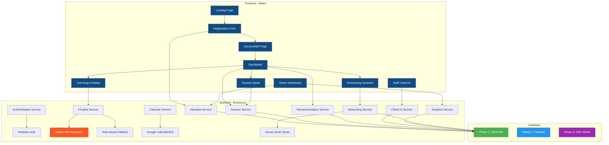
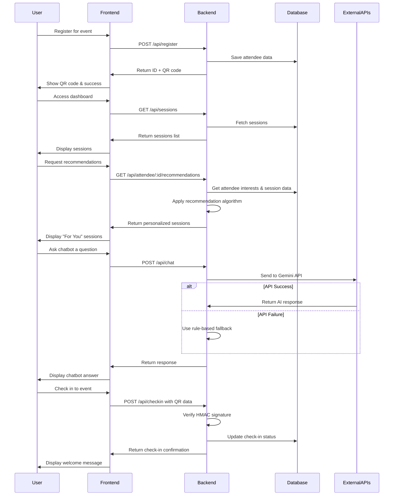
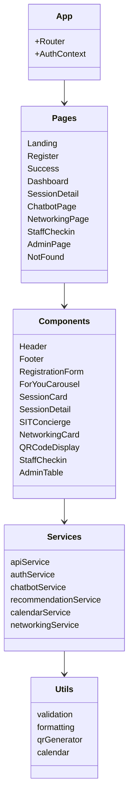
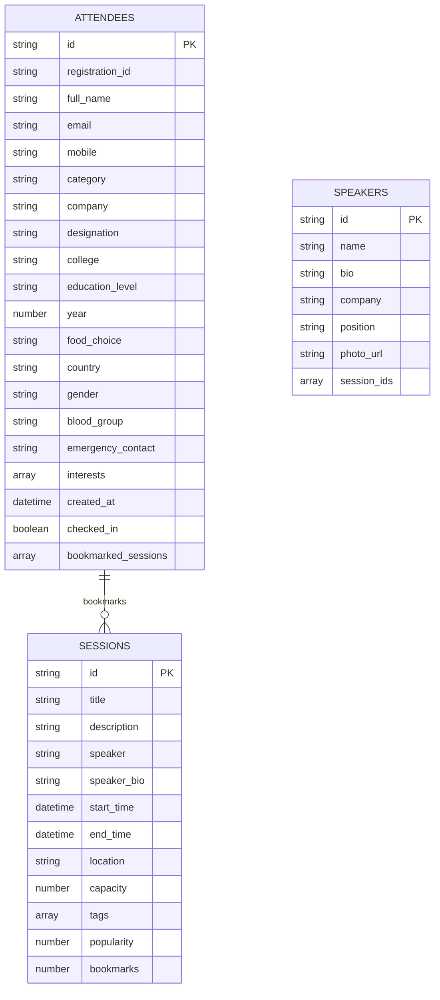
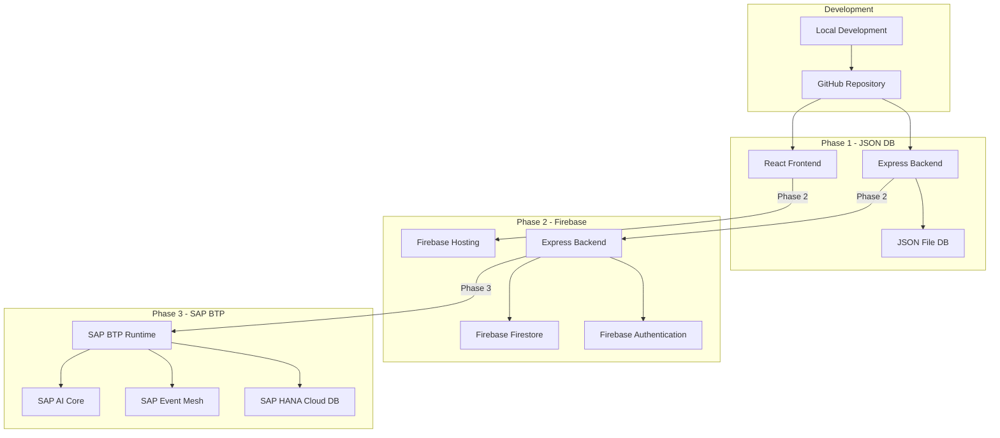

# EventMate Architecture

## System Architecture



## Data Flow Diagram



## Component Structure



## Database Schema



## Deployment Architecture



## How to Generate Diagram Images

To generate PNG images from these Mermaid diagrams:
1. Visit https://mermaid.live/
2. Paste each Mermaid code block into the editor
3. Use the "Export" button to save as PNG
4. Alternatively, install the Mermaid CLI:
   ```bash
   npm install -g @mermaid-js/mermaid-cli
   mmdc -i architecture_diagram.md -o architecture.png
   ```